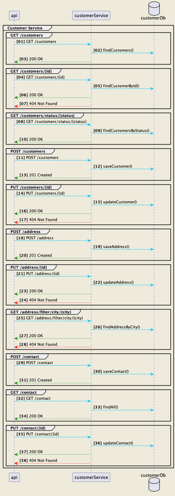

# Customer
This Spring demo project uses the following libraries and frameworks :
1. Data JPA
2. Spring Web MVC
3. H2 in-memory database
4. Actuator
5. Swagger
6. Kafka

This project aims to implement a simple Spring project that exposes an API with various operations to interact with Customer information stored in H2.

# Actuator 
The following endpoints are available for application monitoring :

http://localhost:8080/actuator

# API Swagger 

The swagger documentation for the api endpoints is available at the following URL : http://localhost:8080/swagger-ui.html

# Domain model

The domain model is composed of three entities : Customer, Address and Contact. A Customer can have one address and one contact.

# Kafka

The project uses Kafka to publish events when a customer is created, updated or deleted. The events are published to the topic "customer".
Ensure that Kafka is running on localhost:9092 before starting the application.

# Sequence diagram

