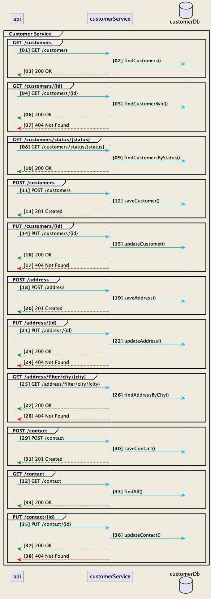

# Customer
This Spring demo project uses the following libraries and frameworks :
1. Data JPA
2. Spring Web MVC
3. H2 in-memory database
4. Actuator
5. Swagger
6. Thymeleaf

This project aims to implement a simple Spring project that exposes an API with various operations to interact with Customer information stored in H2.

A user-interface is also available to interact with the API and is available at http://localhost:8080/view/customers

# UI Pages (Thymeleaf)

The following Thymeleaf UI routes are available:

1. Customer list page: http://localhost:8080/view/customers
2. Create customer page: http://localhost:8080/view/customers/new
3. Edit customer page: http://localhost:8080/view/customers/edit/{id}

For example, to edit customer `1` use:

http://localhost:8080/view/customers/edit/1

# Actuator 
The following endpoints are available for application monitoring :

http://localhost:8080/actuator

# API Swagger 

The swagger documentation for the api endpoints is available at the following URL : http://localhost:8080/swagger-ui.html

The OpenAPI JSON document is available at : http://localhost:8080/api-docs

# Running the application locally

```shell
mvn clean install
mvn spring-boot:run
```

# Running the application in Docker
The Dockerfile is available in the root directory of the project. Build the JAR first, then build and run the Docker image:

```shell
export PATH=/usr/lib/jvm/msopenjdk-25-amd64/bin:$PATH
export JAVA_HOME=/usr/lib/jvm/msopenjdk-25-amd64
mvn clean package -DskipTests
docker build -t customer-service .
docker run -p 8080:8080 customer-service
```

# Test data

The application is preloaded with test data initialized in the data.sql file. The data is loaded when the application starts.

# Domain model

The domain model is composed of three entities : Customer, Address and Contact. A Customer can have one address and one contact.

# Sequence diagram




